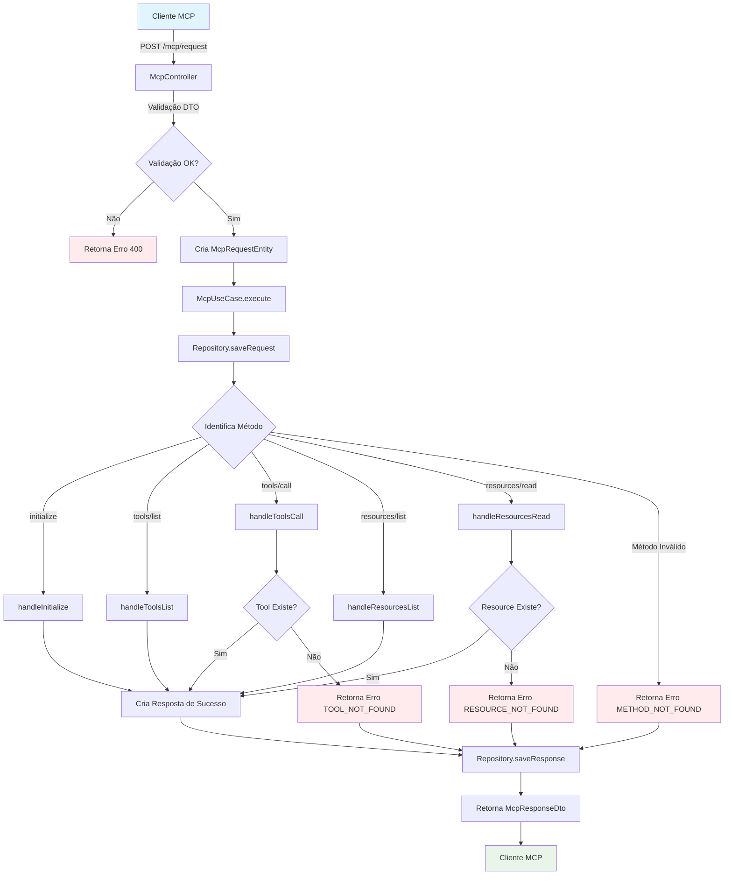

# MCP Server

Um servidor MCP (Model Context Protocol) implementado com NestJS, TypeScript e arquitetura limpa seguindo os princípios SOLID.

## 🏗️ Arquitetura

Este projeto segue os princípios de **Clean Architecture** e **SOLID**, organizando o código em camadas bem definidas:

```
src/
├── domain/           # Camada de domínio (entidades, interfaces, regras de negócio)
│   ├── entities/    # Entidades e tipos do domínio
│   └── interfaces/  # Contratos e interfaces
├── application/      # Camada de aplicação (casos de uso, serviços)
│   └── use-cases/   # Casos de uso da aplicação
├── infrastructure/   # Camada de infraestrutura (repositórios, controllers)
│   ├── controllers/ # Controllers REST
│   └── repositories/# Implementações de repositórios
├── shared/          # Utilitários compartilhados
└── mcp/            # Módulo principal do MCP
```

## 🚀 Tecnologias

- **NestJS** - Framework Node.js para aplicações escaláveis
- **TypeScript** - Superset do JavaScript com tipagem estática
- **pnpm** - Gerenciador de pacotes rápido e eficiente
- **Swagger** - Documentação automática da API
- **Jest** - Framework de testes
- **ESLint + Prettier** - Linting e formatação de código

## 📋 Pré-requisitos

- Node.js >= 18.0.0
- pnpm >= 8.0.0

## 🛠️ Instalação

```bash
# Instalar dependências
pnpm install

# Configurar variáveis de ambiente
cp .env.example .env
```

## 🏃‍♂️ Execução

```bash
# Desenvolvimento
pnpm run start:dev

# Produção
pnpm run build
pnpm run start:prod

# Debug
pnpm run start:debug
```

## 🧪 Testes

```bash
# Executar todos os testes
pnpm run test

# Executar testes em modo watch
pnpm run test:watch

# Executar testes com cobertura
pnpm run test:cov

# Executar testes e2e
pnpm run test:e2e
```

## 📚 Documentação

A documentação da API está disponível em:
- **Swagger UI**: http://localhost:3000/api
- **JSON Schema**: http://localhost:3000/api-json

## 🔧 Scripts Disponíveis

- `pnpm run build` - Compilar o projeto
- `pnpm run start` - Iniciar o servidor
- `pnpm run start:dev` - Iniciar em modo desenvolvimento
- `pnpm run start:debug` - Iniciar em modo debug
- `pnpm run start:prod` - Iniciar em modo produção
- `pnpm run lint` - Executar linter
- `pnpm run format` - Formatar código
- `pnpm run test` - Executar testes
- `pnpm run test:watch` - Executar testes em modo watch
- `pnpm run test:cov` - Executar testes com cobertura

## 🌐 Endpoints

### Health Check
- `GET /` - Status básico do servidor
- `GET /health` - Verificação de saúde detalhada
- `GET /mcp/health` - Status específico do serviço MCP

### MCP Protocol
- `POST /mcp/request` - Processar requisição MCP

## 🔒 Variáveis de Ambiente

```env
# Servidor
PORT=3000
NODE_ENV=development

# CORS
CORS_ORIGIN=*

# Logs
LOG_LEVEL=debug
```

## 📖 Princípios SOLID Aplicados

### Single Responsibility Principle (SRP)
- Cada classe tem uma única responsabilidade
- Controllers apenas recebem requisições
- Use Cases apenas executam lógica de negócio
- Repositories apenas gerenciam dados

### Open/Closed Principle (OCP)
- Interfaces permitem extensão sem modificação
- Novos métodos MCP podem ser adicionados facilmente

### Liskov Substitution Principle (LSP)
- Implementações de interfaces são intercambiáveis
- Repository pode ser substituído por implementação diferente

### Interface Segregation Principle (ISP)
- Interfaces específicas para cada responsabilidade
- Clientes não dependem de métodos não utilizados

### Dependency Inversion Principle (DIP)
- Dependências são injetadas via interfaces
- Camadas superiores não dependem de implementações concretas

## 🏗️ Clean Architecture

### Domain Layer
- **Entidades**: Representam conceitos do negócio
- **Interfaces**: Contratos para camadas externas
- **Regras de Negócio**: Lógica central da aplicação

### Application Layer
- **Use Cases**: Orquestram fluxos de negócio
- **Services**: Serviços de aplicação
- **DTOs**: Objetos de transferência de dados

### Infrastructure Layer
- **Controllers**: Interface HTTP
- **Repositories**: Persistência de dados
- **External Services**: Integrações externas

## 🤝 Contribuição

1. Fork o projeto
2. Crie uma branch para sua feature (`git checkout -b feature/AmazingFeature`)
3. Commit suas mudanças (`git commit -m 'Add some AmazingFeature'`)
4. Push para a branch (`git push origin feature/AmazingFeature`)
5. Abra um Pull Request

## 📄 Licença

Este projeto está sob a licença MIT. Veja o arquivo [LICENSE](LICENSE) para mais detalhes.

## 🔄 Fluxo de Teste do MCP Server

O diagrama abaixo mostra o fluxo completo de processamento de uma requisição MCP:



### 📋 Cenários de Teste

#### ✅ Cenários de Sucesso
1. **Inicialização**: `POST /mcp/request` com método `initialize`
2. **Listar Ferramentas**: `POST /mcp/request` com método `tools/list`
3. **Executar Ferramenta**: `POST /mcp/request` com método `tools/call` e tool `echo`
4. **Listar Recursos**: `POST /mcp/request` com método `resources/list`
5. **Ler Recurso**: `POST /mcp/request` com método `resources/read` e URI válida

#### ❌ Cenários de Erro
1. **Requisição Inválida**: DTO com campos obrigatórios ausentes
2. **Método Não Encontrado**: Método MCP não implementado
3. **Tool Não Encontrada**: Tool inexistente na chamada
4. **Resource Não Encontrado**: URI de recurso inválida
5. **Erro Interno**: Exceções não tratadas

### 🧪 Exemplos de Teste

#### Teste de Inicialização
```bash
curl -X POST http://localhost:3000/mcp/request \
  -H "Content-Type: application/json" \
  -d '{
    "id": "1",
    "method": "initialize",
    "params": {}
  }'
```

#### Teste de Echo Tool
```bash
curl -X POST http://localhost:3000/mcp/request \
  -H "Content-Type: application/json" \
  -d '{
    "id": "2",
    "method": "tools/call",
    "params": {
      "name": "echo",
      "arguments": {
        "message": "Hello MCP Server!"
      }
    }
  }'
```

#### Teste de Health Check
```bash
curl -X GET http://localhost:3000/mcp/health
```

## 📞 Suporte

Para suporte, abra uma issue no repositório ou entre em contato através do email: suporte@exemplo.com